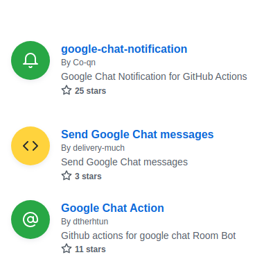

[](https://github.com/javiern8410/actions-google-chat-notification/actions/workflows/test.yml)

# Google Chat Notification for GitHub Actions

Sends a Google Chat notification.



## Usage
### Parameters
|Name|Required|Description|
|:---:|:---:|:---|
|name|true|Job name. Used for notification titles.|
|url|true|Google Chat Webhook URL.|
|status|true|Job status. Available values are `success`, `failure`, `cancelled`. We recommend using `${{ job.status }}` or `${{ steps..outcome/conclusion }}` |
|custom_text|false|Custom text to show in message. Supports HTML tags.|

### Examples
```yaml
- name: google-chat-notifier
  uses: javiern8410/actions-google-chat-notification@v1.0.0
  with:
    name: Build
    url: ${{ secrets.GOOGLE_CHAT_WEBHOOK }}
    status: ${{ job.status }}
    custom_text: 'Your custom message.'
  if: always()
```
